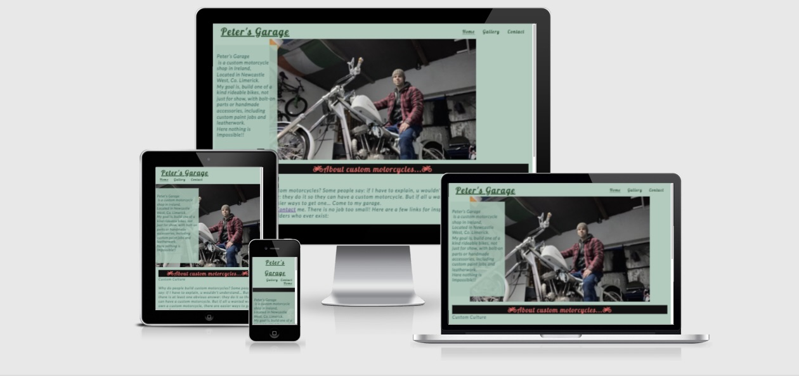

# Peter's Garage
Welcome to [Peter's Garage](https://peterszabo79.github.io/project-no1/) !

Peter’s Garage is a website about Custom Bikes. Show a passion for built motorcycle enthusiasts like me.
Introduce my garage which offers any kind of customization.
Users of this website can read and learn about Custom Bikes, builders, parts, kinds of bikes.
This site is for people who want to find their ways to own and ride a one of a kind motorcycle.

 

# Features

<li>Featured at the top of the page, the navigation shows the garage name in the left corner: Peter’s Garage that links to the Home of the page.</li>
<li>The other navigation links are to the right: Home, Gallery, Contact which links to a different page on the site.</li>
<li>The navigation tells the user the name of the garage and website and makes the different sections easy to find as shown underlined in the active section.</li>

 

</ul>

 

# The Header
<li>The header shows the name of the garage name using Pushster fonts.</li>
<li>The header explains about location, goal, and the type of jobs.</li>
<li>The header also explains about custom culture, provided few links help to understand this special lifestyle with history, builders, custom-parts.</li>
 

 

# Gallery
<li>Gallery shows some images from my bikes, during the building process from beginning to the final multiple prize-winning custom bike.
</li>

 

 

# Contact
<li>The contact page has a section to let users contact me by giving name email and phone number.</li>
<li>The contact page has  a free image downloaded from stocksnap.
</li>
 

 

# Testing
<li>I tested that this page works in different browsers: Chrome, Safari, Firefox, Opera.</li>
<li>I comfirmed that this page is responsive, looks good and functions on all standard screen sizes using devtools device toolbar.</li>
<li>I confirmed that the navigation, header, contact, contact me text are all readable and easy to understand.</li>
<li>I have confirmed the contact form works: requires entries in every field, will only accept an email in the email field, phone number in the phone number field and the submit button works.</li>
<li>I have confirmed the links in the pages are works, open in a new tab.</li>

 

# Validator Testing
<li>HTML<ul>
<li>No errors were returned when passing through the offical W3C validator</li></ul>

<li>CSS<ul>
<li>No errors were returned when passing through the offical (Jigsaw) validator</li></ul>

<li>Accesibility<ul>
<li>I confirmed that the colors and fonts chosen are easy to read and accessibele by running it through Lighthouse in devtools</li></ul>

 

# Deployment
<li>The site was deployed to GitHub pages. The steps to deploy are the follows:</li>
<ul><li>In the Github repository, navigate to the Settings tab</li>
<li>From the source section drop-down menu, select the Master Branch</li>
<li>Once the Master Banch has been selected, the page privided the link to the completed website.</li>

 

The live link can be found here - [Peter's Garage](https://peterszabo79.github.io/project-no1/)
</ul>

 

# Credit

<li>The Code Institute Love Running Walkthrough Project helped me from the beginning thrught finish my project
</li>
<li>Slack. -  #peer-code-review - helped me writing my Readme</li>
<li>Slack. -  #lcetb-nov-2021 - helped fixing typing errors</li>
<li>Google fonts - used to choose my fonts Pushster and Lato </li>
<li>Font awesome - used for social media icons and and a motorbike icon in About custom motorcycles section</li>
<li>Stocksnap-image - free image downloaded for "Contac me" page</li>
<li>Love Running Walkthrough Project -Sign Up Challenge - code used "Contact me" page</li>
<li>Gitpod tricks and trips - used during writing both HTML and CSS</li>
<li>w3school - used during writing both HTML and CSS</li>
<li>developer.mozilla.org - used during writing both HTML and CSS</li>
<li>Grammarly - used for correct my texs</li>
<li>web.dev - used for images loading faster in my "Gallery" </li>
<li>TinyPNG - resize and compress images</li>
<li>Chrome devtools - used for fixing my code all way through in my project</li>
<li>Images and screenshots edited by "Photos" app and "Preview" on mac osx</li>

 

