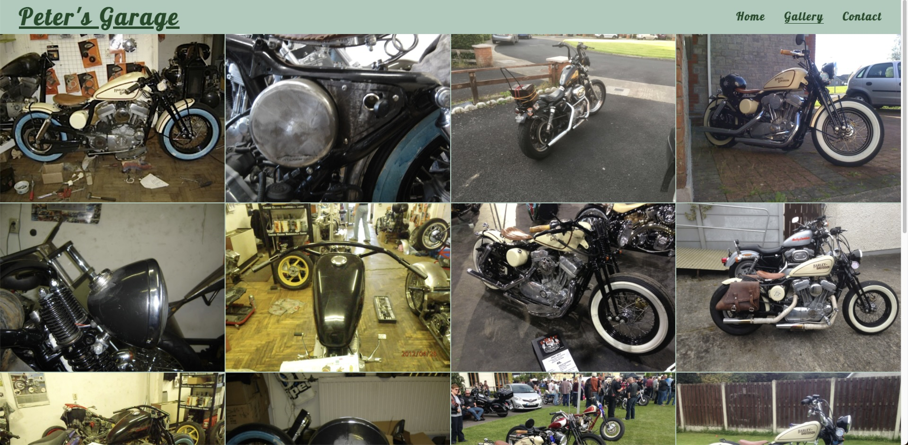

# Peter's Garage
## Welcome to [Peter's Garage](https://peterszabo79.github.io/project-no1/)!

### Peter’s Garage is a website about Custom Bikes. It shows a passion for built-motorcycles for other enthusiasts like me and introduces my garage which offers every kind of customization. Users of this website can read and learn about custom bikes, builders, parts, and different kinds of bikes. This site is for people who want to find a way to own and ride a one-of-a-kind motorcycle.

---

# User Experience (UX)
## User stories
- Customer goals:
  - As a User I want to be able to navigate clearly and logically throughout website
  - As a User I want to learn more about the Garage.
  - As a User I want to be able to see a contact form to the Builder.
  - As a User I want to be able to find an address of the Garage.
  - As a User I want to see pictures of the previous builds.
  - As a User I need to be able to see text and images clearly.
  - As a User I want to learn about Custom Motorcycles.
  - As a User I want to have a positive experience using the website.
## Site Structure
- 'Peter's Garage' consists of 3 page.The User can navigate between via the navigation bar. The Home page is the default loading page. The Logo is linked to the Home Page. On the right hand site of the logo are three navigation links of Home, Gallery and Contact. 
## Design
- Color Scheme:
  - Main color is green, used two shades #1b4b27 and #0a4e43
     
     
  - Other colors are: #e45d5 #e45d5d #fafafa (white) #111010 (black) 
and rgb(162 197 182 / 89%)
- Typography:
  - The fonts used are taken from google fonts named 'Pushster' and 'Lato' with a fall-back of sans-serif.
- Imagery
  - The image used for the hero image it's a white custom chopper with a happy owner who sit on it, which build by the Garage.It's give a good idea of what the Garage might be capable to build.
  - Other images used throughout the website represent the process of a build, with an end goal, a multiple show winner custom bobber also build by the Garage.raise users' interest to come and visit the GameHub venue.

---
  
# Features
- Featured at the top of the page, the navigation shows the garage name in the left corner, “Peter’s Garage” which links to the homepage.
- The other navigation links are to the right: Home, Gallery, and Contact, each linking to a different page on the site.
- The navigation tells the user the name of the garage and website and makes the different sections easy to find. The active page is always shown underlined.
</ul>

---

# [The Header](https://peterszabo79.github.io/project-no1/index.html)
- The header shows the name of the garage name using Pushster fonts.
- The introductory text then explains the garage location, goal, and type of jobs.
- This section also explains about custom culture, providing a few links to help the user to understand this special lifestyle with history, builders and custom parts.

---

# [Gallery](https://peterszabo79.github.io/project-no1/gallery.html)
- The gallery shows some images of my bikes during the building process, from beginning to the final multiple prize-winning custom bike.

---

# [Contact](https://peterszabo79.github.io/project-no1/contact.html)
- The Contact page has a section to let users contact me by giving their name, email and phone number.
- The Contact page also has a free image downloaded from Stocksnap.

---

# Testing
- I tested that this site works in different browsers: Chrome, Safari, Firefox, Opera.
- I confirmed that this site is responsive, looks good and functions well on all standard screen sizes using the Devtools device toolbar.
- I confirmed that the Navigation, Header and Contact text are all readable and easy to understand.
- I have confirmed the contact form works: it requires entries in every field, will only accept an email in the email field and a phone number in the phone number field, and the submit button works.
- I have confirmed the links in the pages all works and external links open in a new tab.

---

# Validator Testing
- HTML
  - No errors were returned when passing through the official W3C validator. All pages were tested: Home, Gallery and Contact.

- CSS
  - No errors were returned when passing through the offical (Jigsaw) validator.

- Accessibility
  - I confirmed that the colors and fonts chosen are easy to read and accessible by running it through Lighthouse in Devtools.

### Home 

### Gallery 

### Contact 

---

# Git & GitHub
I used GitPod as a local repository and IDE and GitHub as a remote repository. The process was:
  1. First i created a new repository on GitHub.
  2. I have then opened that repository on GitPod and started coding.
  3. In GitPod i have created all the pages and and folders.
  4. I was then saving my work and pushing it to GitHub repository to keep it safe.

Process for saving, commiting and pushing it to remote repository goes as follows (done in terminal):

 - `git add .` for adding work to git

 - `git commit -m "+ commit message"` to commit the work on the stage

 - `git push` to update work to GitHub

---

# Deployment
- The site was deployed to GitHub Pages. The steps to deploy are the follows:
  - In the Github repository, navigate to the Settings tab.
  - Scroll down to Pages and click on it.
  - Select Main Branch and click Save.
  - The page provides a link to the completed website.

The live link can be found here - [Peter's Garage](https://peterszabo79.github.io/project-no1/)

---

# Issues
- On the Gallery page, I can't reach more than 85% on Performance. I tried different image sizes and formats to get the best result, and found TinyPNG more effective than Cloud Convert. I also tried the loading attribute - found on web.dev - which didn't make any improvement.

---

# Credits

<li>The Code Institute “Love Running” Walkthrough Project helped me from the beginning through to the finish of my project
</li>
<li>Code Institute’s #peer-code-review Slack channel helped me improve my Readme and my cohort channel helped in fixing typing errors.</li>
<li>Google Fonts was used to choose my fonts, Pushster and Lato.</li>
<li>Font Awesome was used for social media icons and a motorbike icon in "custom motorcycles" section.</li>
<li>Stocksnap-image - free image downloaded for Contact page.</li>
<li>Code Institute’s “Love Running” Walkthrough Project - Sign Up Challenge - code used for the Contact page.</li>
<li>Gitpod “Tips and Tricks” used during writing both HTML and CSS.</li>
<li>W3School was used while writing both HTML and CSS.</li>
<li>developer.mozilla.org was used while writing both HTML and CSS.</li>
<li>Grammarly was used to correct my text.</li>
<li>web.dev was used to test and improve image loading in my “Gallery”.</li>
<li>TinyPNG was used to resize and compress images.</li>
<li>Chrome Devtools was used for fixing my code all the way through my project.</li>
<li>Images and screenshots edited in the Mac OS X "Photos" app and "Preview".</li>

